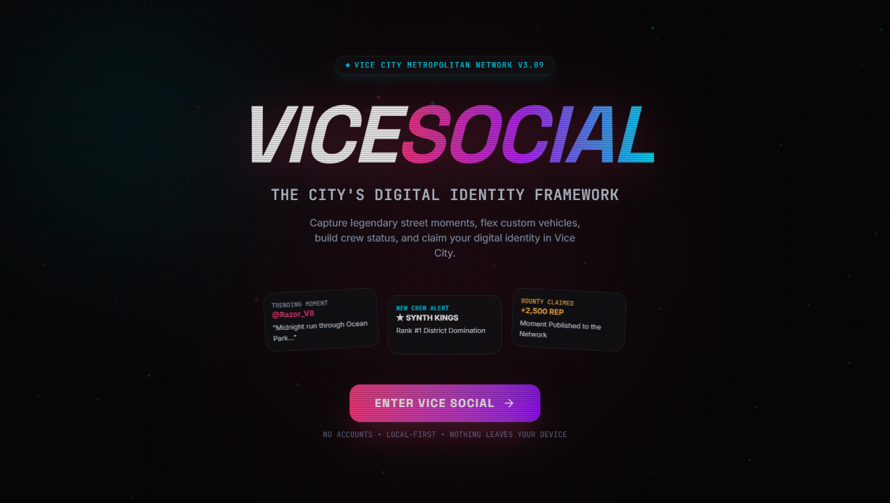
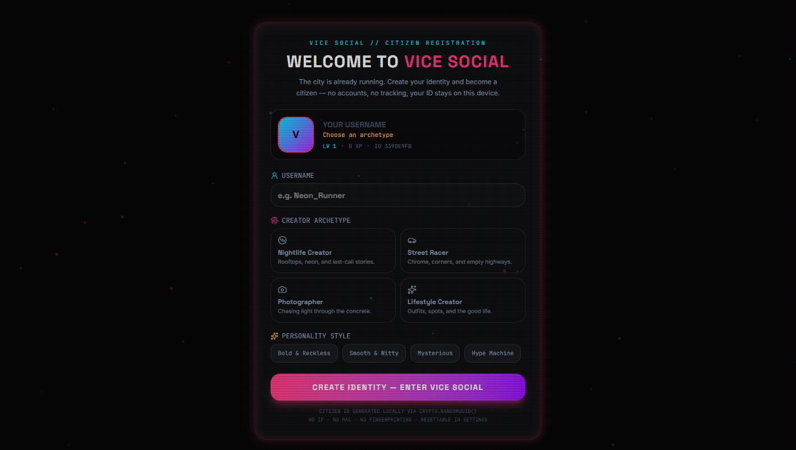
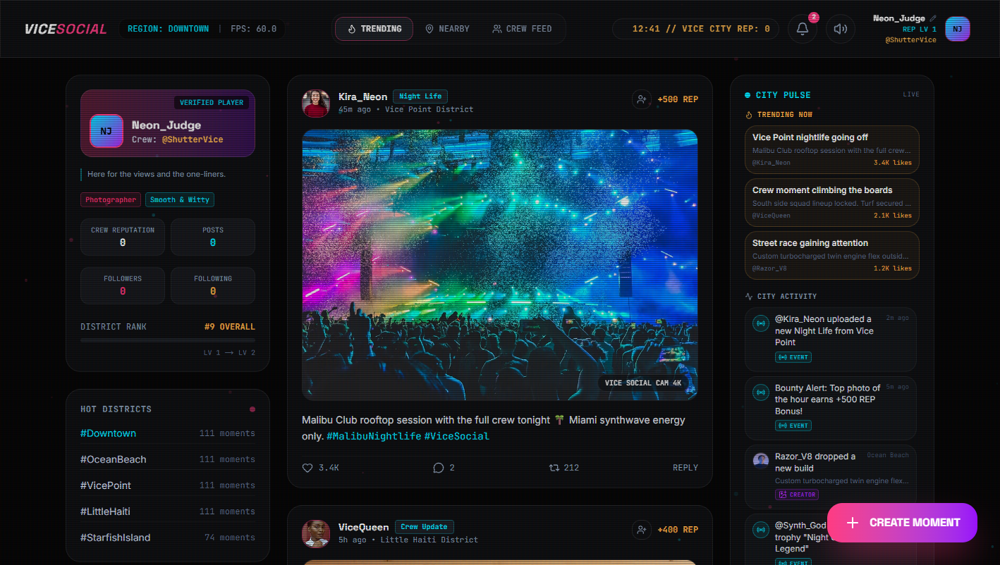
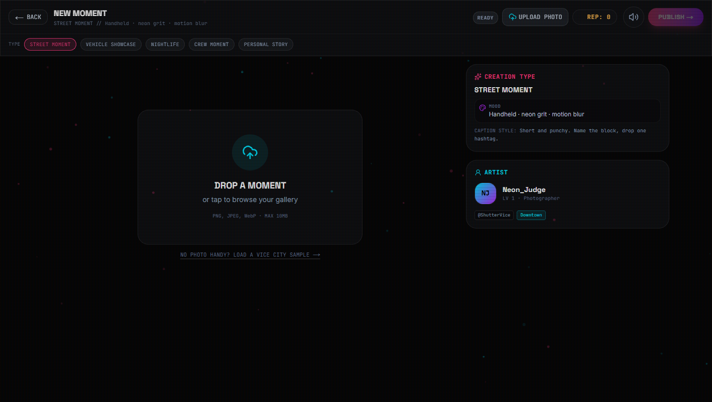
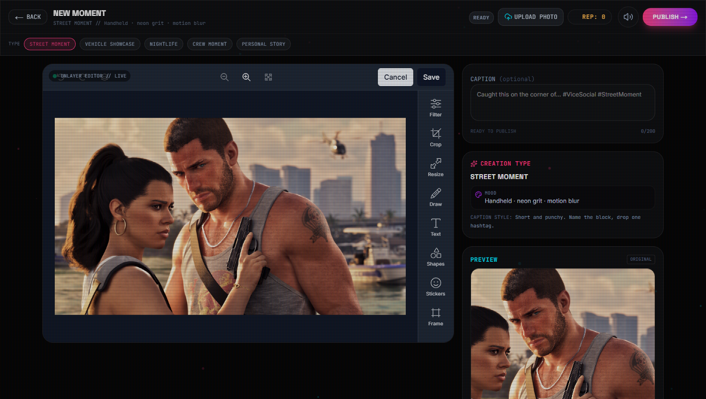
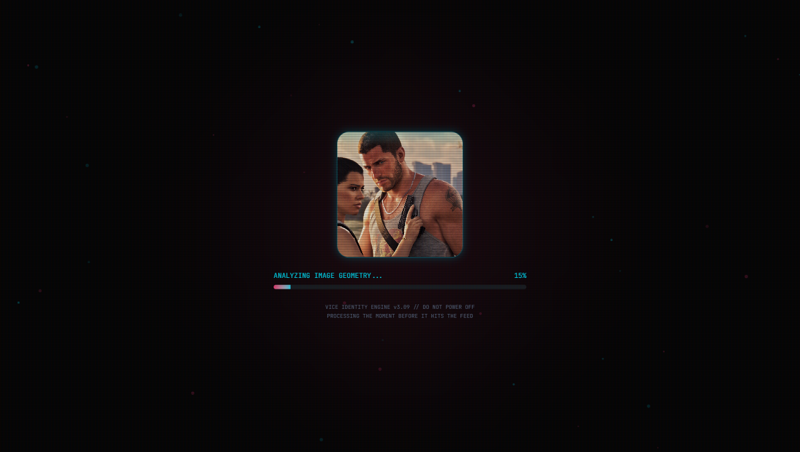
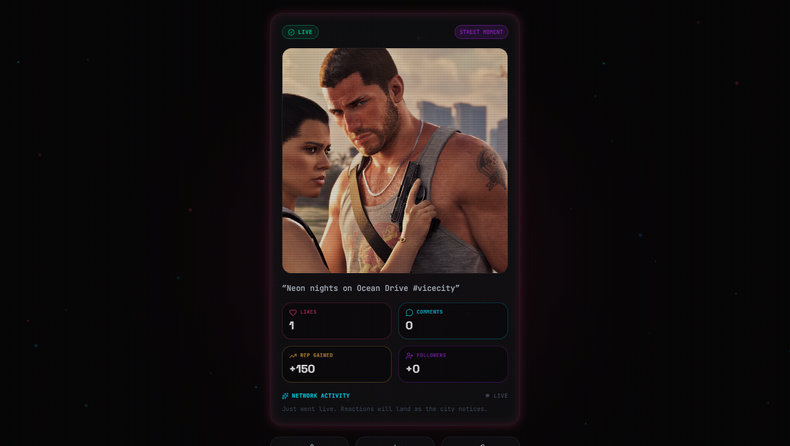
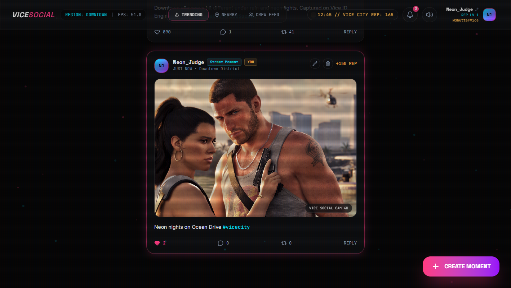

# VICE SOCIAL

**A GTA VI–inspired in-game social network for the web** — a neon-soaked "phone app" from Vice City that runs entirely in the browser. Create a citizen identity, edit photos with a full Unlayer image editor, publish moments, and watch the city react with a deterministic NPC simulation. Local-first: no accounts, no backend, no tracking — everything lives in IndexedDB.

> Fan-made project inspired by Rockstar Games' Grand Theft Auto series. Not affiliated with or endorsed by Rockstar Games.

---

## 60-second demo

1. **`/` splash** → **ENTER VICE SOCIAL**
2. **Onboarding** — pick a username, creator archetype, personality → identity is minted locally (`crypto.randomUUID`)
3. **Feed** (`/snap`) — 3-column HUD: profile + hot districts · moment stream · City Pulse + crew
4. **CREATE MOMENT** (pink FAB) → **Studio**
5. **No photo?** → *LOAD A VICE CITY SAMPLE*, or drop your own (PNG/JPEG/WebP, ≤10MB)
6. **Edit** in Unlayer — crop, filter, draw, text, shapes, stickers, frame → **Save**, add a caption
7. **PUBLISH** → cinematic scan → auto-publish sequence → **LIVE** card with likes / comments / REP / followers ticking in
8. **BACK TO FEED** — your moment is scrolled into view and ring-highlighted; the city keeps reacting (wave + NPC uploads + ambient ticker)

Try **EDIT AGAIN** on the live card (reopens as an edit — no duplicate), like/comment/repost, open a creator from City Pulse, or reset from the profile editor.

---

## Screenshots

| | |
|---|---|
|  |  |
| **Splash** | **Citizen registration** |
|  |  |
| **Feed (City Pulse, districts, tabs)** | **Studio dropzone + sample shot** |
|  |  |
| **Unlayer editor (full toolset)** | **Cinematic reveal scan** |
|  |  |
| **Live engagement after publish** | **Feed focus highlight on your post** |

Regenerate with the production server running:

```bash
pnpm start
node scripts/capture-screenshots.mjs
```

---

## The image editor (judging criterion)

The heart of the app is the **[Unlayer Image Editor](https://unlayer.com)** (`@unlayer/react-image-editor`) — it powers the entire content-creation flow, framed as the in-game Snapmatic.

**Toolset enabled:** crop & resize · filters · draw · text · shapes · stickers · frames · dark theme matched to the Vice HUD.

**Integration** (`components/vice/vice-studio.tsx`):

- Controlled mount: `image={rawImage}`, dark theme, full tool config — **editor internals are not modified**
- Lifecycle: `onLoad` / `onLoadError` / `onError` → boot overlay, ready badge (`UNLAYER EDITOR // LIVE`), error + retry states
- `onSave({ dataUrl })` → explicit save → preview rail
- `hasChanges()` polled (~700ms) → **dirty badge**; if dirty at publish time, **`getImage()` captures the live canvas** so tweaks are never silently dropped
- Upload validated client-side (type + 10MB) *before* the editor mounts
- **Sample shot** path for zero-friction demos: fetches a bundled local image → `File` → same upload pipeline
- Caption sidebar (200 chars, hashtag-aware) sits beside the editor; header PUBLISH is always reachable (desktop rail + mobile-safe header CTA)
- **EDIT AGAIN** after a live publish reopens Studio in *edit* mode for that post (`SAVE CHANGES`) — no accidental duplicates

There is **no pre-made template picker** — upload goes straight into the editor by design.

---

## What else is inside

### Feed & social loop

- Tabs: **TRENDING** (engagement-sorted) · **NEARBY** (your district) · **CREW FEED** (you + follows)
- Like, repost, comment (persisted), follow, delete own posts; clickable hashtags filter the stream
- Real FPS counter (`requestAnimationFrame`), Vice City clock, REP pill + audio toggle
- After publish: feed **scrolls to your moment** and applies a transient neon ring highlight

### Simulation — the city is alive

- **Deterministic publish plans** (`lib/publish-plan.ts`, FNV-1a → mulberry32): quiet window **5.5–11s**, then staggered likes/comments/follows/REP — same caption+context → same rhythm, no Math.random in the beat map
- **NPC uploads** every **55–80s** from `npc-moments.json`; **ambient ticker** every **18–40s** (jittered); both pause when the tab is hidden
- Toasts + persistent inbox (bell → slide-over, unread badge, mark-all-read)

### Identity & progression

- Full profile editor (name, crew, avatar, bio, district), archetypes + personalities from onboarding
- REP score/levels/rank/progress; seeded creator directory; City Pulse sidebar (trending moments + activity)

### Persistence

**IndexedDB** via a hand-rolled transaction-safe layer (`lib/vice-db.ts`, **schema v6**, six stores). Seeds only inject into an empty DB; your data wins. Graceful fallback to in-memory if IndexedDB is unavailable. Full reset reseeds from JSON.

### Seed content (editable)

| File | Contents |
|---|---|
| `data/vice/players.json` | Creator directory + default identity |
| `data/vice/posts.json` | Seed moments (`minutesAgo` timestamps) |
| `data/vice/comments.json` | Seed comments |
| `data/vice/notifications.json` | Seed inbox |
| `data/vice/events.json` | Seed ticker |
| `data/vice/npc-moments.json` | NPC upload pool |

---

## Project description (submission blurb)

**Vice Social** is a fully client-side social network *as a game artifact*: the UI, motion, and simulation all read as a diegetic Vice City phone app rather than a generic social demo. Creativity shows up in the identity gate, delayed “city notices you” engagement, and file-backed seed city; visual execution in the CRT/neon HUD system and restrained Motion transitions; the React Image Editor is a first-class surface (boot/save/dirty/capture states, sample-shot onboarding path) rather than an embedded afterthought; and the core loop closes cleanly — edit → publish → live metrics → your post highlighted on the feed.

---

## Getting started

```bash
pnpm install
pnpm dev
```

Open [http://localhost:3000](http://localhost:3000) → splash → **ENTER VICE SOCIAL** → `/snap`.

```bash
pnpm build   # production build
pnpm start   # serve production build
pnpm lint    # eslint
```

---

## Project structure

```
data/vice/               # Seed content as real JSON (editable)
lib/
  vice-data.ts           # Types, seed normalization, helpers
  vice-db.ts             # Typed IndexedDB layer (v6, six stores)
  publish-plan.ts        # Deterministic NPC engagement plans
  motion.ts              # Shared Motion tokens / variants
  city-pulse.ts          # City Pulse derivation
  sfx.ts                 # Web Audio SFX engine

components/vice/
  vice-app.tsx           # Screen machine + focus/edit orchestration
  vice-provider.tsx      # Store: state + mutations + NPC timers
  vice-feed.tsx          # Feed (tabs, focus scroll/highlight)
  vice-post-card.tsx     # Post card (likes, comments, highlight ring)
  vice-studio.tsx        # ← Unlayer editor shell
  vice-reveal.tsx        # Scan → publish → live engagement
  onboarding.tsx         # Citizen registration
  city-pulse.tsx         # Pulse sidebar
  …                      # modals, toasts, inbox, HUD chrome

app/
  page.tsx               # Splash (static server component)
  snap/page.tsx          # Vice Social experience
  layout.tsx · globals.css

scripts/
  capture-screenshots.mjs # CDP screenshot capture (no extra deps)
```

---

## Tech details

**Stack:** Next.js 16 (App Router) · React 19 · TypeScript strict · Tailwind CSS v4 (`@theme` tokens: `void-black`, `neon-pink #FF3B81`, `neon-cyan #00E5FF`, `amber-gold`) · `motion` v13 · Unlayer `@unlayer/react-image-editor` · lucide-react · pnpm

**Architecture**

- Single `ViceProvider` context — optimistic mutations, fire-and-forget IndexedDB persistence; screens are plain state in `vice-app.tsx`
- Typed JSON seed pipeline (`resolveJsonModule`) → districts validated, avatars resolved, `minutesAgo` → epoch
- Simulation timers (publish plan, ambient, NPC upload) are ref-tracked, StrictMode-safe, visibility-gated
- SFX: tiny Web Audio synth (click/shutter/beep), user-toggleable
- Splash is a static server component; interactive app lives behind `/snap`
- Motion is reduced-motion guarded throughout; transitions stay under ~300ms and support storytelling (entrance stagger, screen crossfade, modal springs)

**Quality bar:** `tsc --noEmit`, `eslint`, and `next build` all pass clean.

## License

Fan-made project inspired by Rockstar Games' Grand Theft Auto series. Not affiliated with or endorsed by Rockstar Games.
